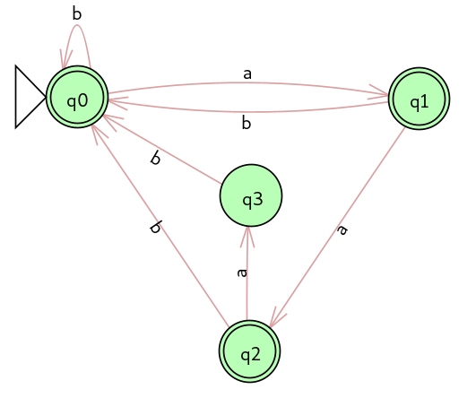
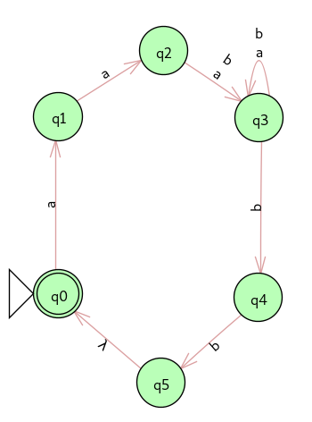
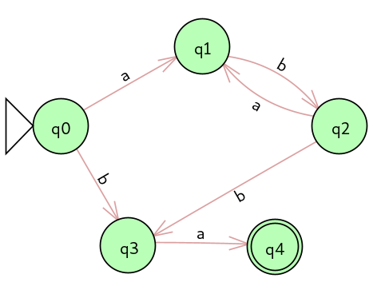

## Lista 02 de Fundamentos Teóricos da Computação

1. Dê a definição recursiva do conjunto de strings sobre o alfabeto {a, b} que contenha um número par de b´s.

    - **R:**
        ```tex
        Σ={a,b} Par(b)
        Caso Base: λ ϵ Par(b)
        Passo Recursivo:
            Se w ϵ Par(b), então
            a.w ϵ Par(b) e w.a ϵ Par(b)
            b.b.w ϵ Par(b), b.w.b ϵ Par(b), w.b.b ϵ Par(b)
        ```

2. Mostre que:

    - a) `(b.a)+ (a*.b* U a*) = (b.a)* b.a+ (b* U λ)`
        - **R:**
            ```tex
            (b.a)+ (a*.b* U a*)
            (b.a)* b.a (a*.b* U a*)
            (b.a)* b.a.a* (b* U λ)
            (b.a)* b.a+ (b* U λ)
            ```
    - b) `b+ (a*.b* U λ) b = b (b*.a* U λ) b+`
        - **R:**
            ```tex
            b+ (a*.b* U λ) b
            b.b* (a*.b* U λ) b
            b (b*.a*.b* U λ.b*) b
            b (b*.a* U λ) b*.b
            b (b*.a* U λ) b+
            ```

3. Forneça as expressões regulares para o conjunto de strings sobre:

    - a) Σ = {a, b} de tamanho >= 2, no qual todos os a’s precedem todos os b’s.
        - **R:** `a+.b+ U b.b+ U a.a+`
    - b) Σ = {a, b} que contém o substring aa.
        - **R:** `(b U a.b U a.a+ b)* a.a+`
    - c) Σ = {a, b} que possui exatamente um par aa.
        - **R:** `(b U a.b)* a.a (b U b.a)*`
    - d) Σ = {a, b, c} que começa com a, contém exatamente dois b’s e termina com cc.
        - **R:** `a (a U c)* b (a U c)* b (a U c)* c.c`
    - e) Σ = {a, b} que contém o substring ab e o substring ba.
        - **R:**
    - f) Σ = {a, b, c} que contém o substring aa, bb e cc.
        - **R:**
    - g) Σ = {a, b, c} no qual cada b é imediatamente seguido por pelo menos um c.
        - **R:**
    - h) Σ = {a, b, c} de tamanho 3.
        - **R:**
    - i) Σ = {a, b, c} com tamanho menor que 3.
        - **R:**
    - j) Σ = {a, b, c} com tamanho maior que 3.
        - **R:**
    - k) Σ = {a, b} com um número par de a’s e impar de b´s.
        - **R:** `(a.b (b.b)* b.a U aa)* (a.b (b.b)* a U b) [(a (b.b)* a) U (b U a (b.b)* b.a) (a.b (b.b)* b.a U a.a)* (a.b (b.b)* a U b)]*`

4. Nos seguintes exercícios, construa AFD’s segundo os enunciados.

    - a) O conjunto de strings sobre Σ = {a, b} que não contém o substring aaa.
        - **R:** 

    - b) O conjunto de strings sobre Σ = {a, b, c} que começa com a, tem exatamente dois b’s e termina com exatamente cc.
        - **R:**

5. Para cada uma das linguagens abaixo, dê um λ-AFN correspondente:

    - a) `(a.b)* b.a`

        - **R:** 

    - b) `(a.b)* (b.a)*`

        - **R:** 

    - c) `(a.b)* b.a ∪ (a.b)* (b.a)*`

        - **R:** `(a.b)* b.a ∪ (a.b)* (b.a)* == (a.b)* [b.a U (b.a)*] == (a.b)* (b.a)*`
          

    - d) `(a.a (a ∪ b)+ b.b)*`
        - **R:**
          

6. Para cada um dos autômatos acima gere o AFD equivalente.

    - a) `(a.b)* b.a`
        - **R:** 
    - b) `(a.b)* (b.a)*`
        - **R:**
    - c) `(a.b)* b.a ∪ (a.b)* (b.a)*`
        - **R:**
    - d) `(a.a (a ∪ b)+ b.b)*`
        - **R:**


7. As seguintes linguagens são regulares? Prove.
    - a) `{ 0^n 1^m | m, n ≥ 0 }`
        - **R:**
    - b) `{ 0^n 1^m 0^n | m, n ≥ 0 }`
        - **R:**
