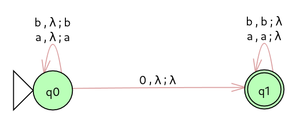
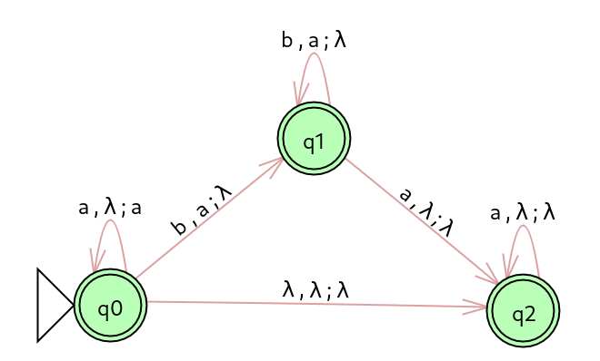

## Lista 04 de Fundamentos Teóricos da Computação

5. Para cada uma das gramáticas a seguir, obtenha uma gramática equivalente na FNC:

    - **a.** S &rarr; aAbB | ABC | a \
       &emsp; A &rarr; aA | a \
       &emsp; B &rarr; bBcC | b \
       &emsp; C &rarr; abc

        - **1º** Tirando recursividade em S - não tem!

        - **2º** Eliminação de produções lambda - não tem!

        - **3º** Remoção de cadeias - não tem!

        - **4º** Eliminação de simbolos inuteis

            - **4.1** Não produzem terminal - não tem!
            - **4.2** Não são alcançaveis - não tem!

        - **G:** Resultado após os passos acima \
           S &rarr; aAbB | ABC | a \
           A &rarr; aA | a \
           B &rarr; bBcC | b \
           C &rarr; abc

        - **5º final:** Modificar as produções para a FNC \
           S &rarr; A1A2 | AB3 | a \
           A &rarr; A1A | a \
           B &rarr; B1C1 | b \
           C &rarr; A1C3 \
           A1 &rarr; a \
           A2 &rarr; AB1 \
           B1 &rarr; B2B \
           B2 &rarr; b \
           B3 &rarr; BC \
           C1 &rarr; C2C \
           C2 &rarr; c \
           C3 &rarr; B2C2

    - **b.** S &rarr; A | ABa | AbA \
       &emsp; A &rarr; Aa | λ \
       &emsp; B &rarr; Bb | BC \
       &emsp; C &rarr; CB | CA | bB

        - **1º** Tirando recursividade em S - não tem!

        - **2º** Eliminação de produções lambda

            - Anulaveis = {**A**, S} \
               S &rarr; **A** | **A**Ba | **A**b**A** \
               **A** &rarr; **A**a | λ \
               S &rarr; A | ABa | AbA | **Ba | Ab | bA | b | λ** \
               A &rarr; Aa | **a**
            - Anulaveis = {A, **S**} \
               **S** &rarr; A | ABa | AbA | Ba | Ab | bA | b | λ

        - **3º** Remoção de cadeias

            - Cadeia = {S} \
               **S** &rarr; A | ABa | AbA | Ba | Ab | bA | b | λ \
               **S** &rarr; **Aa | a** | ABa | AbA | Ba | Ab | bA | b | λ

        - **4º** Eliminação de simbolos inuteis

            - **4.1** Não produzem terminal

                - T = {S,A} \
                  S &rarr; Aa | a | ~~**ABa**~~ | AbA | ~~**Ba**~~ | Ab | bA | b | λ \
                  A &rarr; Aa | a

            - **4.2** Não são alcançáveis - não tem!

        - **G:** Resultado dos passos acima: \
           S &rarr; Aa | a | AbA | Ab | bA | b | λ \
           A &rarr; Aa | a

        - **5º final:** Modificar as produções para a FNC \
           S &rarr; AA1 | a | AA2 | AA3 | A3A | b | λ \
           A &rarr; AA1 | a \
           A1 &rarr; a \
           A2 &rarr; A3A \
           A3 &rarr; b

    - **c.** S &rarr; ABC \
       &emsp; A &rarr; a \
       &emsp; B &rarr; b | bb \
       &emsp; C &rarr; BaB | c

        - **1º** Tirando recursividade em S - não tem!

        - **2º** Eliminação de produções lambda - não tem!

        - **3º** Remoção de cadeias - não tem!

        - **4º** Eliminação de simbolos inuteis

            - **4.1** Não produzem terminal - não tem!
            - **4.2** Não são alcançaveis - não tem!

        - **5º final:** Modificar as produções para a FNC \
           S &rarr; AA1 \
           A &rarr; a \
           B &rarr; b | B1B1 \
           C &rarr; BC1 | c \
           A1 &rarr; BC \
           B1 &rarr; b \
           C1 &rarr; AB

    - **d.** S &rarr; ADE | ABa | AbA \
       &emsp; A &rarr; Aa | λ \
       &emsp; B &rarr; Bb | BC \
       &emsp; C &rarr; CB | CA | bB \
       &emsp; D &rarr; EdD | E \
       &emsp; E &rarr; bcdE | D

6. Prove usando o pumping lemma que as seguintes linguagens não são livres de contexto:

    - **Lema do bombeamento para LLC** \
       z = uvwxy, onde: \
       | vwx | &le; 2k, \
       | v | + | x | > 0 e, \
       ∀ i &ge; 0, uviwxiy ∈ L.

    - **a.** L = { an bn an bn | n > 0 }

        - Hípotese: L é livre de contexto.
        - Considere uma gramatíca livre de contexto na forma normal de Chomsky com K váriaveis.\
          Seja z = a1n b1n a2n b2n,
          n = 2k.\
          Como |z| = 4n = 4 \* 2K e |z| &ge; 2K, então pelo lema do bombeamento:

            - **1.** v, x só conter um tipo de terminal:

              - **1.1** a's. \
                u = a1 \
                vwx = a1n - 1 \
                y = b1n a2n b2n

                É obvio que, se bombear, aumentamos ou diminuimos o número de a1's,\
                mas não o número de b1's, a2's ou b2's.

              - **1.2** análogo para b1's, a2's e b2's.
                - u = a1n \
                  vwx = b1n \
                  y = a2n b2n

                - u = a1n b1n \
                  vwx = a2n \
                  y = b2n

                - u = a1n b1n a2n \
                  vwx = b2n \
                  y = λ

            - **2.** v, x contendo 2 tipos de terminais:

              - **2.1** v ou x conter a1's e b1's \
                - u = a1j \
                  vwx = a1n - j b1n - h \
                  y =  b1h a2n b2n

                  Bombeando v ou x, por exemplo v = ab, z = a1's abababab b's a1's a2 b2,
                  perde a ordem z ∉ L.

                - análogo para b1's a2's
                - análogo para a2's b2's
                - para a1 e a2 é impossivel, por violar a regra 1.
                - para b1's b2's é impossivel, por violar a regra 1.

    - **b.** { 0n 12n 2n | n > 0}

    - **c.** { w wR w | w ∈ {a, b}\* }

7. Construa autômatos de pilha que reconheçam as seguintes linguagens:

    - **a.** { w0wR | w ∈ {a, b}\* }

        - **R:**  

    - **b.** { an bn am | n, m &ge; 0 }

        - **R:**  

    - **c.** { w | w ∈ {a, b, c}\* e o primeiro c seja precedido por aaa }

        - **R:**  
