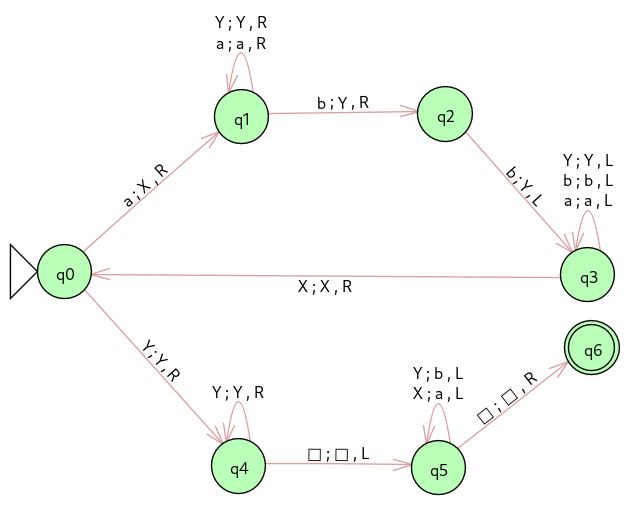
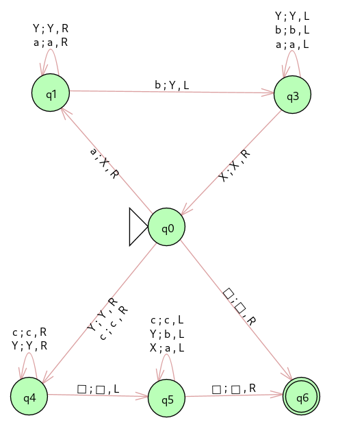
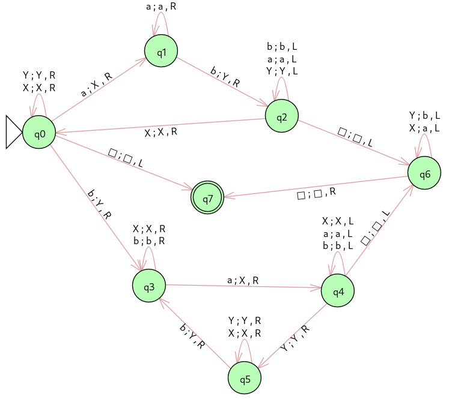
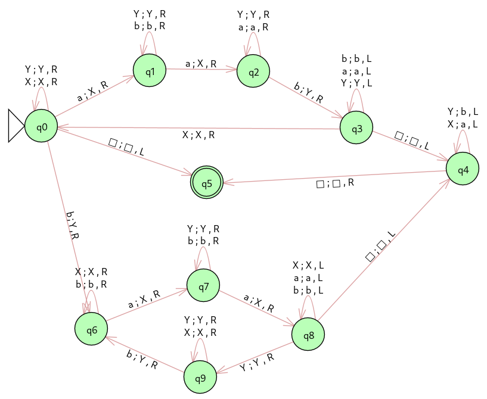

## Lista 5 de Fundamentos Teóricos da Computação

1. Construa máquinas de Turing que aceitem:

    - **a**. L = { aib2i | i > 0}
        - **R:**  
    - **b**. L = { aibick | j = i + k }
        - **R:**  
    - **c**. L = { w ∈ {a, b}\* tal que o número de a's é igual ao número de b's}
        - **R:**  
    - **d**. L = { w ∈ {a, b}\* tal que o número de a's é o dobro do número de b's}
        - **R:**  
    - **e**. L = { w ∈ {a, b}\* tal que o número de a's não é o dobro do número de b's}
        - **R:**  

2. Construa máquinas de Turing que enumerem:

    - **a**. L = { aib2i | i > 0}
    - **b**. L = { a(2i-1)b2i | i > 1}

3. Construa máquinas de Turing que:
    - **a**. Copiem um string w ∈ { a, b }\* para a fita trocando todo os a’s por b e todos os b’s por a.
    - **b**. Copiem o reverso de um string w ∈ { a, b }\* para a fita.
    - **c**. Removam todo substring “aba” de um string w ∈ { a, b }\*.
    - **d**. Verifiquem se w ∈ { a, b, c }\* é palíndromo.
