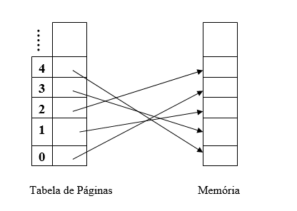

# Lista 04 da disciplina de Sistemas Operacionais

1. Considere uma instrução com endereçamento de memória de 12 bits.
   Suponha um sistema de paginação com um nível apenas.
   Se 4 bits identificam as entradas na tabela de páginas então:

    1. Quantas páginas existem no total?
      - **R:** 2<sup>4</sup> = 16
    2. Qual o tamanho de cada página?
      - **R:** 2<sup>12</sup> / 2<sup>4</sup> = 256
    3. Quais seriam os respectivos endereços dos endereços virtuais 1030 e 519?\
      1030, em binario = 0100 00000110\
      519, em binario = 0010 00000111

      - **R:** 0100 na tabela abaixo aponta para 0000,\
      e 0010 na tabela abaixo aponta para 0100, logo:\
      endereço virtual 1030 é o endereço fisico 6 e \
      endereço virtual 519 é o endereço fisico 1031.

   Considere que todos os quadros estão disponíveis e que a alocação é consecutiva.<br/>
   

2. Você deseja simular uma MMU via software. Faça uma rotina que converta
   endereços virtuais em endereços reais. A palavra é de 16 bits. O total
   páginas é de 256 com cada frame de 256 bytes. Considere um esquema com
   apenas um nível.
   - **R:** 256 = 2<sup>8</sup> = 8 bits para localizar a pagina,\
         e 8 bits para deslocamento no frame/quadro.
   ```
   #code
   ```

3. Um computador tem 4 frames. O tempo de carga, do último acesso e o bit R
   para cada página é mostrado abaixo:
    | Page | Carga | Última referência | R   |
    | ---- | ----- | ----------------- | --- |
    | 0    | 231   | 280               | 1   |
    | 1    | 126   | 260               | 0   |
    | 2    | 128   | 271               | 1   |
    | 3    | 160   | 268               | 1   |

    1. Qual página será substituida se utilizarmos a política MRU?
       - **R:** 0

    2. Qual página será substituida se utilizarmos a política FIFO?
       - **R:** 1

    3. Qual página será substituida se utilizarmos a política LRU?
       - **R:** 1

    4. Qual página será substituida se utilizarmos a política da Segunda Chance?
       - **R:** 3

4. Um sistema operacional suporta uma memória virtual paginada. Cada instrução (palavra) é
   executada em 1 micro segundo. Temos um custo adicional de 1 micro segundo para acessar
   uma página diferente da corrente. Cada página suporta 1000 palavras, e o dispositivo
   de paginação transfere 1 milhão de palavras por segundo. Sabendo que:

   - 1% de todas as instruções executadas acessam páginas diferente da corrente.
   - Das instruções que acessam outras páginas, 80% acessam uma página que já está na memória.
   - Quando uma nova página é requisitada, a página substituída foi modificada  50% das vezes.


    Calcule o tempo efetivo  de execução de uma instrução, assumindo que apenas um processo
    está sendo executado, e que este processo fica suspenso durante a transferência de dados.

      - **R:** <br/>
         T(Palavra) = 1 x 10<sup>-6</sup>s \
         Overhead = 1 x 10<sup>-6</sup>s a cada 1000 palavras \
         Disp.Paginação = 1000000 palavras por segundo. \
         1000000p/s ÷ 1000 palavras/pagina = 1000 paginas cada segundo.
